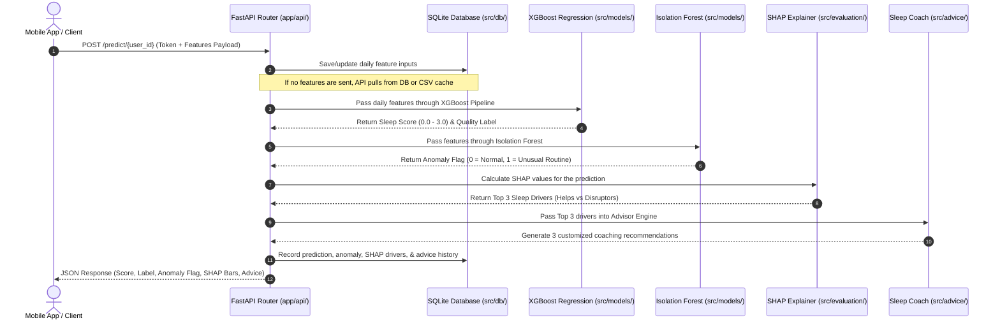

# SleepSense 🌙 — Backend ML & API Platform

> **Predicting Sleep Quality from Daytime Smartphone Behavior**

Welcome to the backend platform for **SleepSense**, an AI-powered behavioral health system. This platform uses passive smartphone telemetry (like phone usage, movement, and physical activity) alongside subjective daily diaries to predict nightly sleep quality without requiring wearable sensors (like smartwatches or rings).

---

## 1. The Core Science & Working Principle

Most sleep systems monitor you *while you sleep*. SleepSense works on a different principle: **your daytime habits predict your night's rest.**

Your daily routines directly regulate sleep patterns:
* **Circadian Rhythm**: The time you first unlock your phone in the morning and last lock it at night maps your wake/sleep alignment.
* **Homeostatic Sleep Drive**: Your active walking/running minutes build physical tiredness (adenosine accumulation), deepening slow-wave sleep.
* **Cortisol & Stress**: Self-reported stress and screen interaction frequencies (frequent unlocks) trigger state arousal, raising cortisol and delaying sleep onset.
* **Environment & Social Context**: Spending time in noisy environments (low silence ratio) or isolating yourself correlates with sleep disruptions.

SleepSense trains machine learning models on the **StudentLife dataset** (Dartmouth College, 2013 — tracking 49 participants over 10 weeks) to predict nightly sleep scores (0.0 to 3.0) and generate actionable recommendations.

---

## 2. End-to-End Data & Execution Flow

Below is the step-by-step lifecycle of a single prediction request:



---

## 3. Machine Learning Concepts (In Simple Terms)

To help you understand how the backend works under the hood, here are the core models explained simply:

### A. XGBoost Regression (Sleep Score Predictor)
* **What it does**: Predicts a continuous score between `0.0` (worst sleep) and `3.0` (best sleep), which is then mapped to labels:
  * `>= 2.5`: *Very good*
  * `1.5 to 2.5`: *Fairly good*
  * `0.5 to 1.5`: *Fairly bad*
  * `< 0.5`: *Very bad*
* **How it works**: XGBoost builds a sequence of small decision trees. Each new tree corrects the mathematical errors made by the previous trees. It combines passive parameters (like walking minutes or phone unlocks) with static indicators (like pre-study PSQI baseline scores) to forecast your sleep quality.

### B. Isolation Forest (Personalized Anomaly Detection)
* **What it does**: Identifies whether a user's daytime routine today is significantly different from their historical baseline (sets `anomaly_flag` to `1` for unusual routines, `0` for normal).
* **How it works**: The model randomly partitions features to isolate data points. If a day's habits are very unusual, the model can isolate that day in just a few partitions (short path length).
* **Personalization**: The backend fits a **custom Isolation Forest model per user** if they have at least 5 days of history. If not, it falls back to a global model trained across all users.

### C. SHAP (Shapley Additive exPlanations)
* **What it does**: Explains *why* the XGBoost model predicted a specific sleep score, identifying the top 3 lifestyle factors that helped or hurt today's sleep.
* **How it works**: Derived from game theory, SHAP determines how much each feature pushes the prediction away from the global average baseline. For example, if you unlock your phone 15 times late at night, SHAP quantifies exactly how much that behavior reduced your predicted sleep score (e.g., `-0.22` points).
* **Actionability**: Static features (like personality traits or the day of the week) are automatically excluded from SHAP consideration so that recommendations target only actionable behaviors (e.g. physical activity, screen usage).

### D. Word2Vec NLP Embeddings (Journal Analyzer)
* **What it does**: Scans the user's subjective text journal entries (e.g., "drank coffee at 4 PM, studied for exams") and extracts numerical features representing caffeine intake, screen time, and stress.
* **How it works**: It maps words to high-dimensional vector spaces. By calculating similarity scores between user notes and target keywords (like 'coffee', 'screen', or 'anxious'), it transforms text notes into numerical metrics that the XGBoost model can use.

---

## 4. Repository Code Structure & Components

Here is a breakdown of what each directory does:

```
SleepSense/
├── app/                           # Backend API & Admin Web Interface
│   ├── api/                       # FastAPI Server Framework
│   │   ├── main.py                # Server Entry Point & Router Registry
│   │   ├── schemas.py             # Data validation contracts (Pydantic)
│   │   ├── security.py            # JWT token validation & password hashing
│   │   └── routers/               # Endpoint Groups (/auth, /predict, /history, /advice)
│   └── frontend/                  # Streamlit Web Dashboard
│
├── src/                           # Core Machine Learning & Logic Pipelines
│   ├── data/                      # Data Processing Layer
│   │   ├── loader.py              # Raw StudentLife JSON/CSV file parsers
│   │   ├── preprocessor.py        # Timestamp alignments & label converters
│   │   └── feature_store.py       # Combines sensory logs & surveys into feature matrices
│   │
│   ├── features/                  # Modality Feature Extractors (Sensing -> Math features)
│   │   ├── activity_features.py   # Walking/running/stationary times
│   │   ├── app_usage_features.py  # Entertainment, social, and study screen sessions
│   │   ├── audio_features.py      # Noise levels & conversation ratios
│   │   ├── gps_features.py        # Location counts & mobility radius
│   │   ├── phonelock_features.py  # Daytime vs late-night screen pickup counts
│   │   ├── ema_features.py        # Mood & stress EMA survey averages
│   │   └── notes_nlp.py           # Word2Vec extractor for daily text logs
│   │
│   ├── models/                    # AI Modeling Layer
│   │   ├── regression.py          # XGBoost & Random Forest pipeline configurations
│   │   ├── anomaly.py             # User-specific Isolation Forest model
│   │   └── trainer.py             # Training loop, grid searches, & saving pipeline models
│   │
│   ├── evaluation/                # Model Explainability & Quality Metrics
│   │   ├── explainability.py      # Computes local SHAP values for predictions
│   │   └── metrics.py             # MSE, R2, Accuracy metrics calculators
│   │
│   ├── db/                        # Local Relational Database Schema
│   │   ├── database.py            # SQLAlchemy SQLite connection setup
│   │   ├── models.py              # SQL tables (User, DailyFeatures, Prediction)
│   │   └── crud.py                # Database queries (CRUD operations)
│   │
│   └── advice/                    # Sleep Coaching Recommendation Engine
│       ├── generator.py           # Unified entry point for recommendations
│       └── llm_generator.py       # Rule-CoT advice templates & local Transformer setup
│
├── models/registry/               # Serialized model pickle files (.pkl)
└── data/                          # Raw & preprocessed datasets (omitted from git)
```

---

## 5. Setup & Running Instructions

### Prerequisites
* [Anaconda](https://www.anaconda.com/) or Miniconda
* Python 3.10+

### Step 1: Environment Activation
Activate the conda environment configured for the project:
```bash
conda activate sleepsense-ai
```

### Step 2: Install Project Dependencies
Install standard requirements and development tools:
```bash
pip install -r requirements.txt
pip install -r requirements-dev.txt
```

### Step 3: Run the FastAPI Server
Launch the backend server locally (listens on port 8000 by default):
```bash
uvicorn app.api.main:app --reload --port 8000
```
* **Interactive Documentation (Swagger)**: Once running, visit [http://localhost:8000/docs](http://localhost:8000/docs) to test API endpoints.

### Step 4: Run the Streamlit Dashboard
To view predicted metrics and explainable data graphs through the web dashboard, run:
```bash
streamlit run app/frontend/streamlit_app.py
```

### Step 5: Run Unit and Integration Tests
To verify all components work correctly, run the test suite:
```bash
pytest
```
